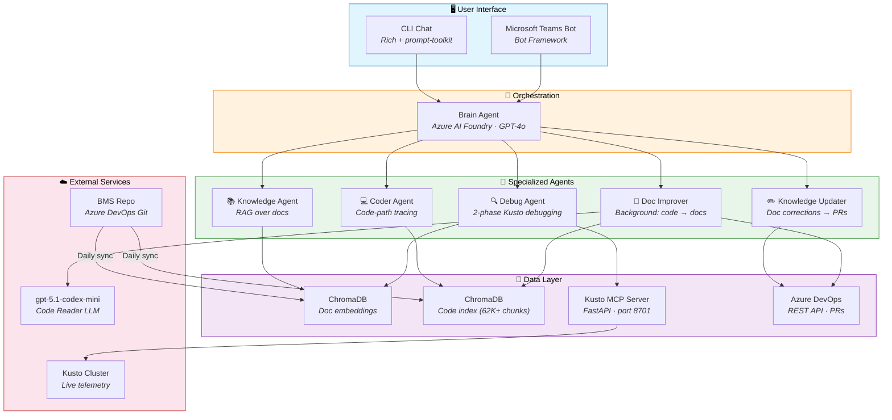
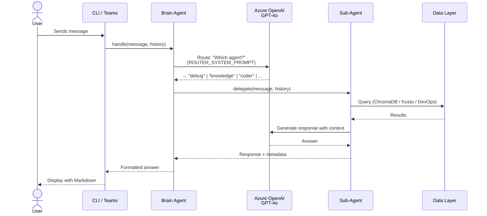
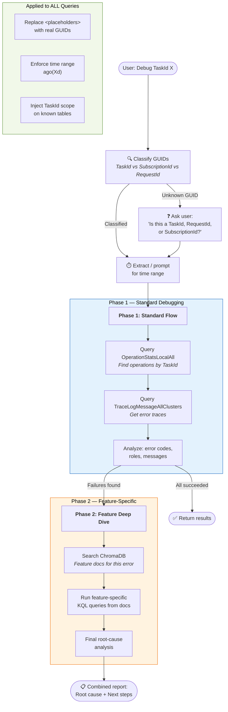
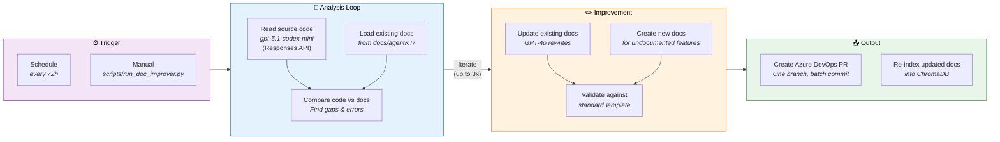
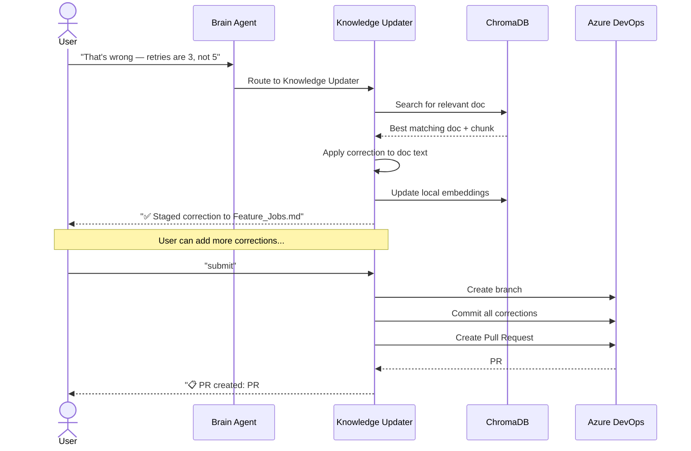
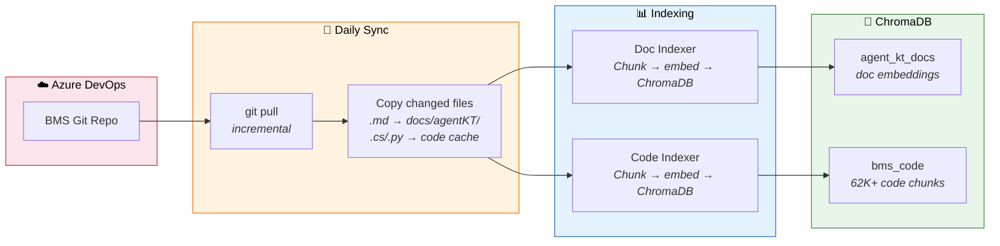

# 🧠 BCDR DeveloperAI - Azure Backup Management AI Assistant

Multi-agent **Hive Architecture** powered by Azure AI Foundry (GPT-4o) — a network of 9 domain-specialized agent clusters that collaborate across BCDR service boundaries. A **Gateway Agent** performs two-stage routing (fast topic matching → LLM tiebreaker) with **anchor term disambiguation** for accurate domain classification. Each hive has its own BrainAgent, docs, code index, and vector collections. A **Discovery Store** (SQLite) auto-extracts routing topics and **code namespaces** from indexed content for automatic cross-service boundary detection. Connects to Azure DevOps documentation and Kusto for intelligent project assistance and debugging. Optionally extends to Microsoft Teams as a bot.

## 🐝 Agent Hive Architecture

The system uses a **Hive Architecture** — a network of domain-specialized agent clusters ("hives") that collaborate across team boundaries to solve complex, cross-cutting issues. Each hive is a self-contained domain with its own BrainAgent, docs, code index, and vector collections.

### Key Features

- **Gateway Agent** — two-stage routing: fast topic keyword match (zero LLM cost) → LLM tiebreaker only when ambiguous
- **Anchor Terms** — high-weight domain-specific terms (e.g., "backup vault", "recovery services vault", "data mobility") prevent routing confusion between similar services
- **Primary Entry Points** — only `primary_hives` (configurable) can be entry points; other hives are reached via boundary detection or proactive discovery
- **Discovery Store** — SQLite-backed auto-topic extraction from indexed content, freshness tracking, staleness warnings, and **namespace-to-hive mapping** for boundary detection
- **Doc + Code Synthesis** — knowledge agent answers are always enriched with source code context from the coder agent, producing unified responses with both architecture concepts and concrete implementation details
- **Auto Boundary Detection** — code namespaces, API routes, and proxy classes are extracted during indexing; coder agents use regex + LLM detection to find cross-service references, with a noise filter that ignores generic framework namespaces (`System.*`, `Microsoft.Extensions.*`, etc.)
- **LLM Relevance Gate** — detected boundaries are filtered by an LLM that decides which are *critical* to the user's question, dropping infrastructure noise before triggering cross-hive lookups
- **Cross-Service Code Resolution** — when a critical boundary is detected (e.g., RSV code references the data-mover service), the system calls the target hive's coder to get the full context
- **🛡️ Grounding Check** — every coder response is post-validated: code symbols (classes, methods, routes, file paths) inside fenced blocks that don't appear in the retrieved evidence are flagged as potentially fabricated, with a clear warning appended to the response
- **🚫 Anti-Fabrication Prompts** — system prompts at every layer (coder, doc+code synthesis, multi-hive synthesis) explicitly forbid inventing code, endpoints, or APIs; the LLM must quote retrieved content exactly or say "not found"
- **Config-driven hives** — each hive defined in `config.yaml` → `hives.definitions`
- **Proactive cross-hive discovery** — the router analyzes primary responses for cross-service references and automatically fans out targeted sub-questions to other hives
- **Cross-hive callback (`[ASK:]`)** — agents can query other hives mid-response and get answers back inline, producing ONE cohesive response instead of post-hoc synthesis
- **Explicit delegation (`[DELEGATE:]`)** — agents can emit `[DELEGATE:<hive>]` signals for full hand-off when the question is entirely another domain's territory
- **Multi-hive synthesis** — responses from multiple services are unified into a single end-to-end flow with strict anti-fabrication rules
- **Graceful degradation** — if any hive's vector index is missing or corrupt, the system logs a warning and returns no hits for that hive instead of crashing
- **`/save` command** — export any response as rich Markdown with Mermaid routing diagrams and metadata
- **Backward compatible** — set `hives.enabled: false` to use the classic single-BrainAgent mode

### Query Modes

Prefix any question with these flags to control how it's processed (combinable in any order):

| Mode | Flag | What it does | When to use |
|------|------|--------------|-------------|
| **Default** | _(none)_ | Routes to the primary hive → maybe consults 1–2 related hives via discovery | Specific questions, follow-ups, fast answers |
| **Clarify** | `-c` | LLM checks if the question is ambiguous; if so, asks 1–2 clarifying questions before routing | Broad/vague questions where you want the AI to ask for specifics |
| **All-hives** | `-a` | Cheap parallel YES/NO relevance check on every hive → deep query on YES hives in parallel → evidence-grounded synthesis | Cross-cutting questions that span multiple services |
| **Both** | `-c -a` | Clarify first → then all-hives mode | Big exploratory dives |

Examples:
```
explain me data mobility                    # default: fast, focused
-c explain me data mobility                 # clarify first, then route
-a explain me data mobility                 # ask all relevant hives in parallel
-c -a explain me data mobility              # clarify, then all-hives
```

### Tenant Isolation

Use `excluded_hives` in `config.yaml` to completely remove a hive from the system:

```yaml
hives:
  default_hive: "rsv"
  primary_hives: ["rsv"]
  excluded_hives: ["dpp"]   # DPP fully disabled — not loaded, not reachable
```

| Tenant | `default_hive` | `primary_hives` | `excluded_hives` |
|--------|----------------|-----------------|------------------|
| RSV-only | `"rsv"` | `["rsv"]` | `["dpp"]` |
| DPP-only | `"dpp"` | `["dpp"]` | `["rsv"]` |
| Both available | `"rsv"` (or `dpp`) | `["dpp", "rsv"]` | `[]` |

When a hive is excluded, it is **not loaded** into the registry, **not consultable** via discovery / `[ASK:]` / `[DELEGATE:]`, and **not in the boundary map** — zero calls will ever reach it. Config validation fails fast at startup if `primary_hives` or `default_hive` reference an excluded hive.

### Concept

```mermaid
graph TB
    subgraph Gateway["🌐 Gateway Layer"]
        Router["🧭 Top-Level Router Agent<br/><i>Intent classification · Hive selection<br/>Cross-hive orchestration</i>"]
    end

    subgraph DPP_Hive["🐝 DPP Hive<br/><i>Data Protection Platform</i>"]
        DPP_Brain["🧠 DPP Brain"]
        DPP_Know["📚 Knowledge"]
        DPP_Debug["🔍 Debug"]
        DPP_Code["💻 Coder"]
        DPP_Brain --> DPP_Know
        DPP_Brain --> DPP_Debug
        DPP_Brain --> DPP_Code
    end

    subgraph RSV_Hive["🐝 RSV Hive<br/><i>Recovery Services Vault</i>"]
        RSV_Brain["🧠 RSV Brain"]
        RSV_Know["📚 Knowledge"]
        RSV_Debug["🔍 Debug"]
        RSV_Code["💻 Coder"]
        RSV_Brain --> RSV_Know
        RSV_Brain --> RSV_Debug
        RSV_Brain --> RSV_Code
    end

    subgraph Common_Hive["🐝 Common Hive<br/><i>Shared Libraries & Infra</i>"]
        COM_Brain["🧠 Common Brain"]
        COM_Know["📚 Knowledge"]
        COM_Code["💻 Coder"]
        COM_Brain --> COM_Know
        COM_Brain --> COM_Code
    end

    subgraph Prot_Hive["🐝 Protection Hive<br/><i>Workload Coordination</i>"]
        PROT_Brain["🧠 Protection Brain"]
        PROT_Know["📚 Knowledge"]
        PROT_Debug["🔍 Debug"]
        PROT_Code["💻 Coder"]
        PROT_Brain --> PROT_Know
        PROT_Brain --> PROT_Debug
        PROT_Brain --> PROT_Code
    end

    subgraph DP_Hive["🐝 DataPlane Hive<br/><i>Backup Data Plane</i>"]
        DP_Brain["🧠 DataPlane Brain"]
        DP_Know["📚 Knowledge"]
        DP_Code["💻 Coder"]
        DP_Brain --> DP_Know
        DP_Brain --> DP_Code
    end

    subgraph Reg_Hive["🐝 Regional Hive<br/><i>Regional RP</i>"]
        REG_Brain["🧠 Regional Brain"]
    end

    subgraph PIT_Hive["🐝 PIT Catalog Hive<br/><i>Recovery Points</i>"]
        PIT_Brain["🧠 PIT Brain"]
    end

    subgraph DM_Hive["🐝 DataMover Hive<br/><i>Data Movement</i>"]
        DM_Brain["🧠 DataMover Brain"]
    end

    subgraph Mon_Hive["🐝 Monitoring Hive<br/><i>Alerting & Telemetry</i>"]
        MON_Brain["🧠 Monitoring Brain"]
    end

    Router --> DPP_Brain
    Router --> RSV_Brain
    Router --> COM_Brain
    Router --> PROT_Brain
    Router --> DP_Brain
    Router --> REG_Brain
    Router --> PIT_Brain
    Router --> DM_Brain
    Router --> MON_Brain

    DPP_Brain <-. "[ASK:]" .-> RSV_Brain
    DPP_Brain <-. "[ASK:]" .-> PROT_Brain
    RSV_Brain <-. "[ASK:]" .-> COM_Brain
    DPP_Brain <-. "[ASK:]" .-> PIT_Brain
    DPP_Brain <-. "[ASK:]" .-> DM_Brain

    style Gateway fill:#fff3e0,stroke:#e65100,color:#000
    style DPP_Hive fill:#e3f2fd,stroke:#1565c0,color:#000
    style RSV_Hive fill:#e8eaf6,stroke:#283593,color:#000
    style Common_Hive fill:#e8f5e9,stroke:#2e7d32,color:#000
    style Prot_Hive fill:#fce4ec,stroke:#b71c1c,color:#000
    style DP_Hive fill:#f3e5f5,stroke:#6a1b9a,color:#000
    style Reg_Hive fill:#e0f2f1,stroke:#00695c,color:#000
    style PIT_Hive fill:#fff8e1,stroke:#f9a825,color:#000
    style DM_Hive fill:#fbe9e7,stroke:#bf360c,color:#000
    style Mon_Hive fill:#f1f8e9,stroke:#558b2f,color:#000
```



### How It Works

| Layer | Role | Details |
|-------|------|---------|
| **Gateway Agent** | Two-stage routing | Stage 1: scores all hives via topic keyword matching (anchor terms = 5pts, exact phrase = 3pts, partial word = 1.5pts). If one hive wins by 2× margin → routes directly (zero LLM cost). Stage 2: LLM tiebreaker with only the top 4 candidates for ambiguous queries. |
| **Discovery Store** | Auto-topic extraction & freshness | SQLite DB tracks per-hive index metadata, auto-extracted topics (via LLM sampling of ChromaDB content), namespace-to-hive mappings for boundary detection, and staleness. Topics are merged with config.yaml at hive init. |
| **Top-Level Router** | Cross-hive orchestration | Dispatches to the Gateway-selected hive, handles delegation signals, triggers proactive discovery, and synthesizes multi-hive responses. |
| **Hive Brain** | Domain-local orchestrator | Each hive has its own Brain Agent that routes internally to its Knowledge, Debug, and Coder agents — scoped to that domain's docs, code, and Kusto tables. Always combines doc + code for deeper answers. |
| **Auto Boundary Detection** | Cross-service code awareness | During indexing, C# namespaces, API routes, and proxy classes are extracted and stored in the discovery store. At query time, the coder agent uses regex pattern matching on code chunks + file-level imports metadata to detect cross-hive references. If regex finds nothing, an LLM fallback analyzes the code for implicit dependencies (REST calls, queues, comments). |
| **Cross-Service Resolution** | Boundary code context | When boundaries are detected, the system calls the target hive's coder (`analyze_simple`) to get code context without recursion, then includes that cross-service context in the LLM prompt for a complete end-to-end answer. |
| **Proactive Discovery** | Automatic cross-service consultation | After getting the primary answer, the router analyzes it for references to other services and fans out targeted sub-questions to those hives automatically. |
| **Cross-Hive Callback** | Agent-initiated `[ASK:]` | Agents emit `[ASK:<hive>] <question>` mid-response to query another domain. The Hive intercepts, resolves via Gateway callback, re-injects the answer, and lets the agent write ONE cohesive response. Max 3 rounds, no recursive callbacks. |
| **Cross-Hive Delegation** | Agent-to-agent hand-off | Agents emit `[DELEGATE:<hive>] <context>` for full hand-off when the question is entirely outside their domain. The router intercepts and orchestrates. |
| **Multi-Hive Synthesis** | Unified response | All responses are synthesized into a single end-to-end flow with cross-service interactions clearly documented. |

### Active Hives (9 domains)

| Hive | Domain | Code Scope | Agents |
|------|--------|-----------|--------|
| **dpp** ⭐ | Data Protection Platform | `src/Service/Dpp` | knowledge, debug, coder, knowledge_updater |
| **rsv** | Recovery Services Vault | `src/Service/BackupProviders`, `RestApi` | knowledge, debug, coder, knowledge_updater |
| **dataplane** | Backup Data Plane | `Mgmt-RecoverySvcs-BackupDataPlane` | knowledge, debug, coder |
| **common** | Common Libraries & Infrastructure | `Mgmt-RecoverySvcs-Common` | knowledge, coder |
| **protection** | Workload Coordination & Protection | `Mgmt-RecoverySvcs-WkloadCoord` | knowledge, debug, coder |
| **regional** | Regional Resource Provider | `Mgmt-RecoverySvcs-RegionalRP` | knowledge, coder |
| **pitcatalog** | PIT Catalog (Recovery Points) | `Mgmt-RecoverySvcs-RegionalRP` | knowledge, coder |
| **datamover** | Data Mover Service | `Mgmt-RecoverySvcs-DataMover` | knowledge, coder |
| **monitoring** | Monitoring & Alerting | `Mgmt-RecoverySvcs-Monitoring` | knowledge, debug, coder |

### Cross-Hive Scenario

> **User:** _"A backup job for SQL on Azure VM failed with error code `UserErrorVmNotFound`. The job ID is `abc-123`. What went wrong?"_
>
> 1. **Gateway** → topic match scores DPP highest ("backup job", "UserError") → dispatches to **DPP Hive**
> 2. **DPP Debug Agent** → queries Kusto, finds the job failed during VM snapshot phase
> 3. **DPP Agent** emits `[ASK:protection] How does the workload plugin handle VM snapshot failures?`
> 4. **Hive intercepts** → calls **Protection Hive** via Gateway callback → gets answer about VM deallocated state
> 5. **DPP Agent** receives the answer inline → also emits `[ASK:common] What SDK retry policy applies?`
> 6. **Hive intercepts** → calls **Common Hive** → gets answer about 3-retry exponential backoff
> 7. **DPP Agent** writes ONE cohesive response: _"The backup failed because the VM was deallocated. The Protection workload plugin attempted 3 retries (Common SDK exponential backoff) but the VM never came back online. Fix: ensure VM is running or configure pre-backup scripts."_

### Design Principles

- **Each hive is self-contained** — own ChromaDB collections, own Kusto table scope, own doc set
- **Hives are independently deployable** — a team can spin up their own hive and register it with the router
- **Cross-hive protocol is message-based** — hives communicate via structured requests/responses, not shared memory
- **The router never does domain work** — it only classifies, dispatches, and synthesizes
- **Backward compatible** — today's single-hive BMS setup becomes one node in the larger network

### Key Files

| File | Purpose |
|------|---------|
| `brain_ai/hive/gateway.py` | `Gateway` — two-stage routing (topic match → LLM tiebreaker) |
| `brain_ai/hive/hive.py` | `Hive` class — self-contained domain agent cluster |
| `brain_ai/hive/registry.py` | `HiveRegistry` — holds all hive instances |
| `brain_ai/hive/router.py` | `HiveRouter` — orchestration, discovery, synthesis |
| `brain_ai/hive/discovery_store.py` | `DiscoveryStore` — SQLite metadata, topics, freshness |
| `brain_ai/hive/topic_extractor.py` | `TopicExtractor` — LLM-based topic extraction from indexed content |
| `brain_ai/cli/main.py` | Unified CLI (`brainai chat`, `status`, `gateway-test`, etc.) |
| `brain_ai/cli/chat.py` | Rich interactive chat with `/save`, `/status`, routing diagrams |
| `scripts/run_hive_index.py` | Index code for all hives with `--refresh-topics` support |
| `tests/test_hive.py` | 195 unit tests for the hive architecture |

### Quick Start

```bash
# Install
pip install -e .

# Start interactive chat (with Gateway routing & Rich color output)
brainai chat

# Show hive index status, topic counts & staleness
brainai status

# Test gateway routing with sample questions
brainai gateway-test

# Index all hives (or a specific one)
brainai hive-index
brainai hive-index --hive dpp

# Auto-extract routing topics from indexed content
brainai hive-index --refresh-topics

# Chat commands
/hives          # List all 9 hives & topics
/status         # Index status & staleness
/save           # Save last response as Markdown with Mermaid diagram
/save out.md    # Save to a specific file
/help           # All commands
```

---

## Brain Agent Architecture



> **How it works:** The **Brain Agent** routes every user message to the best sub-agent based on intent.
> Agents query ChromaDB (docs & code), Kusto (live telemetry), or Azure DevOps (PRs) as needed.
> The **Doc Improver** runs in the background, reading source code with `gpt-5.1-codex-mini` and creating PRs for documentation gaps.

## Design

### Request Lifecycle

Every user message flows through this pipeline — from input to routed agent to final response:



### Debug Agent — 2-Phase Flow

The Debug Agent runs a structured investigation: first a broad standard flow, then a targeted deep dive using feature documentation:



### Doc Improver Agent — Background Workflow

The Doc Improver runs on a schedule, reading source code and comparing it against existing documentation to find and fix gaps:



### Knowledge Updater — Correction Flow



### Data Sync Pipeline



## Prerequisites: Azure AI Foundry Model Setup

BCDR DeveloperAI requires two model deployments on [Azure AI Foundry](https://ai.azure.com/) (formerly Azure OpenAI Service). Follow these steps to create them.

### Step 1: Create an Azure AI Foundry Resource

1. Go to the [Azure Portal](https://portal.azure.com) → **Create a resource** → search **"Azure AI services"**
2. Click **Azure OpenAI** → **Create**
3. Fill in:
   | Field | Value |
   |-------|-------|
   | **Subscription** | Your Azure subscription |
   | **Resource group** | Create new or use existing (e.g., `BCDR-devai-rg`) |
   | **Region** | `East US 2` (or any region with GPT-4o availability) |
   | **Name** | e.g., `BCDR-devai-aoai` |
   | **Pricing tier** | `Standard S0` |
4. Click **Review + Create** → **Create**
5. Once deployed, go to the resource → **Keys and Endpoint** → copy:
   - **Endpoint** (e.g., `https://BCDR-devai-aoai.openai.azure.com/`)
   - **Key 1** (API key)

### Step 2: Deploy the Main Model (GPT-4o-mini)

This is the primary model used by all agents for routing, reasoning, and response generation.

1. Go to [Azure AI Foundry](https://ai.azure.com/) → select your resource
2. Click **Deployments** → **+ Create deployment**
3. Configure:
   | Setting | Value |
   |---------|-------|
   | **Model** | `gpt-4o-mini` |
   | **Deployment name** | `gpt-4o-mini` ⚠️ _Must match `config.yaml → llm.model`_ |
   | **Deployment type** | Standard |
   | **Tokens per minute rate limit** | 80K+ recommended (adjust to your usage) |
4. Click **Create**

### Step 3: Deploy the Code Reader Model (gpt-5.1-codex-mini)

This model is used by the **Doc Improver Agent** for reading and analyzing source code. It's optional — only needed if you plan to use the Doc Improver.

1. In Azure AI Foundry → **Deployments** → **+ Create deployment**
2. Configure:
   | Setting | Value |
   |---------|-------|
   | **Model** | `gpt-5.1-codex-mini` (or latest Codex model available) |
   | **Deployment name** | `gpt-5.1-codex-mini` ⚠️ _Must match `config.yaml → code_reader_llm.model`_ |
   | **Deployment type** | Standard |
   | **Tokens per minute rate limit** | 30K+ recommended |
3. Click **Create**

> **Note:** Codex models use the **Responses API** (`client.responses.create()`), not the Chat Completions API. BCDR DeveloperAI handles this automatically — if the model name contains `codex`, the Code Reader LLM switches to the Responses API.

### Step 4: Add Credentials to Config

Put your endpoint and API key in `config.local.yaml` (gitignored — never committed):

```yaml
# config.local.yaml
llm:
  endpoint: "https://BCDR-devai-aoai.openai.azure.com/"
  api_key: "<YOUR_API_KEY>"

# Only needed if Doc Improver uses a different resource / key
code_reader_llm:
  endpoint: "https://BCDR-devai-aoai.openai.azure.com/"
  api_key: "<YOUR_API_KEY>"
```

Or set via environment variables:
```bash
export BCDR_DEVAI_LLM_API_KEY="<YOUR_API_KEY>"
```

### Model Summary

| Model | Config Key | Used By | API |
|-------|-----------|---------|-----|
| `gpt-4o-mini` | `llm.model` | Brain Agent, Knowledge, Debug, Coder, Knowledge Updater, Doc Improver (writing) | Chat Completions |
| `gpt-5.1-codex-mini` | `code_reader_llm.model` | Doc Improver (code reading) | Responses API |

> **💡 Tip:** Both models can share the same Azure AI Foundry resource and API key — just create two deployments under the same resource. The deployment name in Azure must exactly match the `model` value in `config.yaml`.

## Quick Start

### Option A: One-Command Setup (Recommended)

Run the setup script to do everything in one go — creates the venv, installs
dependencies, syncs docs, indexes everything, and optionally starts services:

```powershell
# PowerShell (Windows)
.\setup.ps1                        # Normal setup
.\setup.ps1 -Force                 # Force re-sync + re-index everything
.\setup.ps1 -SkipKusto             # Skip starting the Kusto server
.\setup.ps1 -SkipDocImprover       # Skip the Doc Improver cycle
```

```bash
# Bash (Linux / Mac / WSL)
chmod +x setup.sh
./setup.sh                         # Normal setup
./setup.sh --force                 # Force re-sync + re-index everything
./setup.sh --skip-kusto            # Skip starting the Kusto server
./setup.sh --skip-doc-improver     # Skip the Doc Improver cycle
```

The script will:
1. Create a `.venv` virtual environment (if missing)
2. Install all pip dependencies + editable package
3. Create `config.yaml` + `config.local.yaml` from templates (secrets go in `config.local.yaml`)
4. Sync docs from Azure DevOps
5. Index docs into ChromaDB
6. Index source code into ChromaDB
7. Run the Doc Improver (if enabled — handles bootstrap from zero docs)
8. Start the Kusto MCP server in background

### Option B: Install from Wheel (no clone needed)

If you received the `.whl` file (e.g. via Teams or a shared drive), you can install without cloning the repo:

```bash
# 1. Create & activate a venv
python -m venv .venv
# Windows: & .\.venv\Scripts\Activate.ps1
# Linux/Mac: source .venv/bin/activate

# 2. Install the wheel (all dependencies included)
pip install bcdr_devai-0.1.0-py3-none-any.whl

# 3. Set up config files
#    Copy config.yaml.template and config.local.yaml.template from the repo
#    or create them manually (see Configuration section below).

# 4. Start chatting
brainai chat
```

The `brainai` command is automatically available after install — no need to clone the repo or run scripts.

> **Building a new wheel** (for maintainers):
> ```bash
> pip install build
> python -m build
> # Output: dist/bcdr_devai-<version>-py3-none-any.whl
> ```

### Option C: Step-by-Step Setup (from source)

#### 1. Create & activate a virtual environment

```powershell
# PowerShell (Windows)
python -m venv .venv
& .\.venv\Scripts\Activate.ps1
```

```bash
# Bash (Linux / Mac / WSL)
python3 -m venv .venv
source .venv/bin/activate
```

> **Important:** You must activate the venv every time you open a new terminal.
> You'll know it's active when you see `(.venv)` at the start of your prompt.
> All commands below (`pip install`, `python scripts/run_chat.py`, etc.) must be run
> inside the activated venv.

#### 2. Install dependencies

```bash
pip install -r requirements.txt
# Or install as a package (includes all dependencies):
pip install -e .
```

#### 3. Configure

```bash
cp config.yaml.template config.yaml               # Generic settings (safe to commit)
cp config.local.yaml.template config.local.yaml     # Secrets (gitignored)
# Edit config.local.yaml with your:
#   - Azure DevOps PAT
#   - Azure AI Foundry endpoint & API key
#   - Kusto cluster URL & database
```

#### 4. Sync docs from Azure DevOps

```bash
python scripts/run_sync.py          # Incremental sync
python scripts/run_sync.py --force  # Force full sync
```

#### 5. Index docs into ChromaDB

```bash
python scripts/run_index.py          # Incremental
python scripts/run_index.py --force  # Force re-index
```

#### 6. Index source code (for Coder Agent)

```bash
python scripts/run_code_index.py          # Incremental
python scripts/run_code_index.py --force  # Force re-index
```

This indexes `.cs`, `.py`, `.json`, `.config` files from the BMS repo
into a separate ChromaDB collection so the Coder Agent can trace code paths.

#### 7. Start chatting

```bash
python scripts/run_chat.py
```

This is the **primary interface** for BCDR DeveloperAI. `run_chat.py` runs **automatic pre-flight checks** before launching the chat:

| Check | What it does |
|-------|-------------|
| Config | Validates `config.yaml` + `config.local.yaml` exist and have required fields |
| LLM | Verifies Azure AI Foundry endpoint & API key are set |
| ChromaDB | Checks if docs are indexed (warns if empty) |
| Code Index | Checks if source code is indexed for Coder Agent |
| Kusto MCP | Auto-starts the Kusto MCP server if not already running |

**Options:**

```bash
python scripts/run_chat.py --no-kusto          # Skip auto-starting Kusto MCP server
python scripts/run_chat.py --config my.yaml    # Use a custom config file
```

You can also run the Kusto MCP server **standalone** (e.g., for other tools):

```bash
python scripts/run_kusto_server.py              # default port 8701
python scripts/run_kusto_server.py --port 8701  # custom port
```

## CLI Commands

| Command    | Description                              |
|------------|------------------------------------------|
| `/help`    | Show help message                        |
| `/clear`   | Clear conversation history               |
| `/agents`  | List available agents                    |
| `/hives`   | List available hives & their scopes      |
| `/status`  | Show hive index status, staleness & topic counts |
| `/kusto`   | Check Kusto MCP server status            |
| `/code`    | Check code index status                  |
| `/pending` | Show staged doc corrections (if any)     |
| `/save`    | Save last response as rich Markdown (with Mermaid routing diagram) |
| `/logs`    | Toggle verbose logging on/off            |
| `/quit`    | Exit the chat                            |

### Query flags (prefix any question)

| Flag       | Description                              |
|------------|------------------------------------------|
| _(none)_   | Default routing — fast, focused, primary hive + selective consult |
| `-c`       | Clarify first — LLM asks 1–2 clarifying questions if the question is ambiguous |
| `-a`       | All-hives — parallel relevance check across all hives, then deep query on relevant ones |
| `-c -a`    | Clarify, then all-hives                  |

## Daily Sync (Automation)

Run `run_daily.py` via cron or Windows Task Scheduler to keep both docs and source code up to date:

```bash
# Linux/Mac cron (daily at 2 AM)
0 2 * * * cd /path/to/BCDR_devai && python scripts/run_daily.py >> daily_sync.log 2>&1

# Or run manually
python scripts/run_daily.py
```

## Agent Overview

| Agent | Purpose | Data Source |
|-------|---------|-------------|
| **Knowledge** | Architecture & feature Q&A | ChromaDB (indexed docs) |
| **Debug** | Investigate job failures & errors | Kusto (live telemetry) + docs |
| **Coder** | Trace code paths & find root causes | ChromaDB (indexed source code) |
| **Knowledge Updater** | Correct docs & create PRs | ChromaDB + Azure DevOps REST API |
| **Doc Improver** | Background: auto-improve docs from code | ChromaDB (code) + gpt-5.1-codex-mini → PRs |

Routing is fully LLM-based — the Brain Agent reads conversation history and
selects the best sub-agent for each message.

### Knowledge Updater Workflow

When you spot incorrect or outdated documentation during a chat, the Knowledge
Updater Agent lets you fix it without leaving the conversation:

1. **State the correction** — e.g., _"That's wrong — retry logic uses 3 retries, not 5."_
2. The agent extracts the correction, finds the relevant doc, applies the edit,
   and **stages it locally**. Your local knowledge is updated immediately.
3. Provide more corrections if needed — they accumulate in the session.
4. Say **"submit"** or **"agree"** to batch all corrections into a **single
   Azure DevOps Pull Request** (one branch, one commit).
5. Say **"discard"** to drop all staged corrections without creating a PR.

Safety nets:
- Switching to another agent while corrections are pending shows a warning.
- `/quit` prompts you to submit or discard before exiting.
- `/clear` asks for confirmation before discarding pending corrections.

> **KQL sanitization:** Queries generated by the Debug Agent are automatically
> cleaned — leading `.project` commands, `database(...)` / `cluster(...)` scoping
> prefixes, and decorative comments are stripped before execution.

### Adding New Agents

1. Create a new agent class in `brain_ai/agents/` with a `handle(message, history)` method.
2. Register it in `config.yaml` under `agents.enabled`.
3. Update the `ROUTER_SYSTEM_PROMPT` in `brain_agent.py` to include the new agent's description.
4. Add initialization in `BrainAgent.__init__()`.

## Project Structure

```
BCDR-DeveloperAI/
├── brain_ai/                    # Python package
│   ├── config.py                # Configuration loader
│   ├── llm_client.py            # Azure AI Foundry LLM client
│   ├── code_reader_llm.py       # Code-optimized LLM (gpt-5.1-codex-mini)
│   ├── startup.py               # Pre-flight checks & dependency launcher
│   ├── sync/
│   │   ├── repo_sync.py         # Azure DevOps repo sync
│   │   └── devops_pr.py         # Azure DevOps PR helper (REST API)
│   ├── vectorstore/
│   │   ├── indexer.py           # ChromaDB document indexer
│   │   └── code_indexer.py      # ChromaDB source code indexer
│   ├── agents/
│   │   ├── brain_agent.py       # Router/orchestrator (+ hive context support)
│   │   ├── knowledge_agent.py   # RAG-based Q&A over docs
│   │   ├── debug_agent.py       # Kusto debug agent
│   │   ├── coder_agent.py       # Code path tracing agent
│   │   ├── knowledge_updater_agent.py  # Doc correction & PR agent
│   │   └── doc_improver_agent.py       # Background doc improvement agent
│   ├── hive/                    # 🐝 Agent Hive Architecture
│   │   ├── __init__.py          # Package exports
│   │   ├── hive.py              # Hive — self-contained domain agent cluster
│   │   ├── registry.py          # HiveRegistry — holds all hive instances
│   │   └── router.py            # HiveRouter — top-level routing & synthesis
│   ├── kusto/
│   │   ├── client.py            # Kusto MCP client
│   │   └── server.py            # Kusto MCP server (FastAPI)
│   ├── bot/
│   │   ├── teams_bot.py         # Teams bot (ActivityHandler)
│   │   ├── adapter.py           # Bot Framework adapter
│   │   ├── app.py               # aiohttp web app + background services
│   │   └── teams_manifest/      # Teams app manifest template
│   └── cli/
│       └── chat.py              # CLI chat interface
├── deploy/
│   ├── main.bicep               # Azure Bicep IaC template
│   ├── parameters.json          # Deployment parameters template
│   └── deploy.ps1               # One-command deployment script
├── tests/                       # Unit tests
├── Dockerfile                   # Multi-stage Docker build
├── docker-compose.yml           # Docker Compose for all services
├── .env.template                # Environment variables template
├── config.yaml                  # Generic settings (committed)
├── config.local.yaml            # Secrets & overrides (gitignored)
├── config.yaml.template         # Template for config.yaml
├── config.local.yaml.template   # Template for secrets
├── pyproject.toml               # Package config & dependencies
├── requirements.txt             # Pip requirements
├── scripts/
│   ├── run_chat.py              # CLI chat entry point
│   ├── run_bot.py               # Teams Bot entry point
│   ├── run_sync.py              # Sync docs entry point
│   ├── run_index.py             # Index docs entry point
│   ├── run_code_index.py        # Index source code entry point
│   ├── run_daily.py             # Daily sync+index automation
│   ├── run_kusto_server.py      # Kusto MCP server entry point
│   ├── run_doc_improver.py      # Doc Improver entry point
│   └── run_hive_index.py        # 🐝 Hive code indexer entry point
├── setup.ps1                    # One-command setup (PowerShell)
└── setup.sh                     # One-command setup (Bash)
```

## Doc Improver Agent (Background Workflow)

The Doc Improver Agent is a background workflow that automatically improves documentation by reading the actual source code and comparing it against existing docs.

### How It Works

1. **Code Analysis** — Uses `gpt-5.1-codex-mini` (code-optimized model) to analyze source code from the ChromaDB code index and configured repo folders
2. **Gap Detection** — Compares code reality against documentation claims to find:
   - Missing information (undocumented APIs, code paths, validations)
   - Incorrect information (doc claims that contradict code)
   - Missing debugging patterns & KQL queries
   - Missing telemetry references
3. **Iterative Improvement** — Runs multiple passes (configurable, default 3) to refine docs, converging when no more changes are found
4. **Feature Discovery** — Scans the codebase for features that have no documentation at all and creates new doc files
5. **PR Creation** — If substantive changes are found (above `min_diff_lines` threshold), creates a single Azure DevOps PR with all improvements

### Standard Doc Template

Every feature doc follows this structure:
1. **Overview** — Feature purpose and scope
2. **API Endpoints** — Routes, HTTP methods, FM constants
3. **Request/Response Flow** — Code path from controller to catalog
4. **Business Logic & Validation** — Rules, state checks, errors
5. **State Machine / Lifecycle** — States and transitions
6. **Telemetry & Logging** — OpStats, activity stats, trace events
7. **Debugging Patterns & KQL Queries** — Concrete queries for common debug scenarios
8. **Error Handling** — Error codes, retry logic, failure modes
9. **Related Features** — Cross-references

### Running

```bash
# Run one improvement cycle
python run_doc_improver.py

# Force run (ignore interval timer)
python run_doc_improver.py --force

# Override max iterations
python run_doc_improver.py --iterations 5

# Run as a repeating daemon
python run_doc_improver.py --daemon
```

### Configuration

```yaml
# config.yaml — model & structural settings (committed)
code_reader_llm:
  model: "gpt-5.1-codex-mini"
  max_tokens: 16384

# Doc Improver settings
doc_improver:
  enabled: true
  run_interval_hours: 72        # How often to run
  max_iterations: 3             # Improvement passes per cycle
  code_folders:                 # Repo folders to read for code analysis
    - "src/Microsoft.Azure.Management.BackupManagement"
  protected_docs:               # Docs that are NEVER modified
    - "BackupMgmt_Architecture_Memory.md"
  branch_prefix: "BCDR-devai/doc-improvement"
  min_diff_lines: 10            # Minimum changed lines to create a PR
```

### Safety Rules

- `BackupMgmt_Architecture_Memory.md` is **protected** — never modified
- Retains the existing `DPP/` and `RSV/` folder structure
- References `Telemetry_And_Logging_Reference.md` for all KQL patterns
- Only creates a PR when meaningful changes are discovered
- Runs automatically as a background service when the Teams Bot is deployed

---

## Extensions

### Microsoft Teams Bot

BCDR DeveloperAI can optionally be deployed as a Microsoft Teams bot, providing the same
multi-agent experience directly in Teams channels and chats.

#### Features

| Feature | Description |
|---------|-------------|
| **@mention responses** | Tag @BCDR-DeveloperAI in any channel to ask a question |
| **Auto-reply (10 min)** | If nobody answers a channel question within 10 minutes, BCDR DeveloperAI responds automatically |
| **1:1 chat** | Direct message the bot for private conversations |
| **Session isolation** | Each conversation gets its own BrainAgent session |
| **Commands** | `help`, `clear`, `agents` — same as the CLI |

#### Local Development

1. Install Teams bot dependencies:
   ```bash
   pip install "BCDR-devai[teams]"
   # or: pip install botbuilder-core aiohttp
   ```

2. Start the bot locally:
   ```bash
   python run_bot.py
   ```

3. Use [Bot Framework Emulator](https://github.com/microsoft/BotFramework-Emulator) to test at `http://localhost:3978/api/messages`

4. For Teams testing, use [ngrok](https://ngrok.com/) or [dev tunnels](https://learn.microsoft.com/en-us/azure/developer/dev-tunnels/):
   ```bash
   ngrok http 3978
   # Then update your Bot registration's messaging endpoint with the ngrok URL
   ```

#### Bot Registration

1. Go to [Azure Portal](https://portal.azure.com) → Create **Azure Bot** resource
2. Note the **App ID** and generate an **App Password** (client secret)
3. Set messaging endpoint to `https://<your-domain>/api/messages`
4. Enable the **Microsoft Teams** channel
5. Update `config.local.yaml`:
   ```yaml
   teams_bot:
     app_id: "<YOUR_APP_ID>"
     app_password: "<YOUR_APP_PASSWORD>"
   ```

### Deployment (Azure Container Apps)

For production use, BCDR DeveloperAI ships with Docker + Azure Bicep infrastructure for one-command cloud deployment.

#### What Gets Deployed

| Resource | Purpose |
|----------|---------|
| **Azure Container Registry** | Stores the Docker image |
| **Azure Container Apps** | Runs the bot + all background services |
| **Azure Bot Service** | Connects to Microsoft Teams |
| **Log Analytics Workspace** | Centralized logging |

**All background services run inside the single container:**
- 🤖 Teams Bot (port 3978)
- 🔍 Kusto MCP server (port 8701)
- 📅 Daily sync scheduler (configurable interval)
- 💡 Unanswered-message auto-reply monitor
- 📝 Doc Improver Agent (configurable cycle interval)

#### Option A: One-Command Deploy (Recommended)

```powershell
.\deploy\deploy.ps1 -ResourceGroup BCDR-devai-rg `
    -BotAppId "<APP_ID>" `
    -BotAppPassword "<APP_PASSWORD>" `
    -LlmApiKey "<LLM_KEY>" `
    -AzureDevOpsPat "<PAT>"
```

Or run interactively (prompts for values):
```powershell
.\deploy\deploy.ps1
```

#### Option B: Docker Compose (Self-Hosted)

```bash
# Copy and fill in environment variables
cp .env.template .env
# Edit .env with your secrets

# Build and start
docker compose up -d

# Check logs
docker compose logs -f BCDR-devai-bot

# Trigger manual sync
docker compose exec BCDR-devai-bot python run_daily.py
```

#### Option C: Manual Azure Deployment

```bash
# 1. Create resource group
az group create --name BCDR-devai-rg --location eastus2

# 2. Deploy infrastructure
az deployment group create \
  --resource-group BCDR-devai-rg \
  --parameters deploy/parameters.json

# 3. Build & push image
az acr login --name BCDRdevaiacr
docker build -t BCDRdevaiacr.azurecr.io/BCDR-devai:latest .
docker push BCDRdevaiacr.azurecr.io/BCDR-devai:latest

# 4. Update container app
az containerapp update --name BCDR-devai-bot \
  --resource-group BCDR-devai-rg \
  --image BCDRdevaiacr.azurecr.io/BCDR-devai:latest
```

#### Updating After Code Changes

```powershell
# Rebuild and push image only (skip infra redeployment)
.\deploy\deploy.ps1 -SkipDeploy -ResourceGroup BCDR-devai-rg
```

## Future Roadmap

### ✅ Completed

- [x] Coder Agent — code path tracing over indexed BMS source
- [x] Knowledge Updater Agent — session-based doc corrections with batch Azure DevOps PRs
- [x] KQL query sanitization — auto-strips `.project` commands & scoping prefixes
- [x] MS Teams Bot integration (Azure Bot Service)
- [x] Docker containerization for deployment
- [x] Azure Container Apps deployment (Bicep IaC)
- [x] Doc Improver Agent — background auto-improvement of docs from code analysis
- [x] **Agent Hive Architecture** — 7-domain multi-hive routing with proactive cross-hive discovery _(see below)_

### 🔜 Next Up

- [ ] **GitHub Copilot CLI Extension** — expose BrainAI as a `@bcdr` Copilot Chat participant so developers can query directly from VS Code / GitHub Copilot CLI (`gh copilot ask @bcdr "how does soft delete work?"`)
- [ ] **Copilot Agent Mode integration** — register as a [Copilot Extension](https://docs.github.com/en/copilot/building-copilot-extensions) so the hive architecture is available as a Copilot skill across IDE, CLI, and GitHub.com
- [ ] **Hosted service deployment** — deploy as a shared service (Azure Container Apps + API gateway) so any BCDR team member can use it without local setup. SSO via Azure AD, rate-limited per user.
- [ ] **Web UI dashboard** — React/Next.js frontend with hive visualization, conversation history, and admin panel for managing hives, indexing, and docs
- [ ] **Azure Key Vault for secrets management** — replace `config.local.yaml` with Key Vault references for production deployments

### 🧠 Intelligence Improvements

- [ ] **Hive auto-indexing pipeline** — Azure DevOps pipeline that triggers re-indexing when code is merged to main (webhook → `run_hive_index.py --hive <changed_repo>`)
- [ ] **Smart deep mode** — auto-detect when a question is cross-cutting vs. single-domain and skip the discovery step for simple follow-ups (reduce latency by 60%)
- [ ] **Confidence-based routing** — combine LLM routing with embedding similarity scores from each hive's vector store for more accurate hive selection
- [ ] **Conversation memory across sessions** — persist conversation history to a database so users can resume investigations across days
- [ ] **Learning from corrections** — when Knowledge Updater fixes docs, feed corrections back into the embedding index automatically

### 🤖 New Agents

- [ ] **CI/CD Pipeline Agent** — diagnose build failures, analyze pipeline logs, suggest fixes for broken deployments
- [ ] **PR Review Agent** — auto-review pull requests against architecture docs and coding standards, flag deviations
- [ ] **Incident Triage Agent** — integrate with IcM/ServiceNow, correlate incidents with Kusto telemetry, suggest root cause and mitigation
- [ ] **Test Gap Agent** — analyze code changes and suggest missing test cases based on modified code paths
- [ ] **Onboarding Agent** — guided walkthrough for new team members, generates personalized learning paths based on their assigned area

### 🏗️ Platform & Scale

- [x] **CLI consolidation** — unified `brainai` CLI + legacy `run_*.py` scripts moved to `scripts/` folder
- [x] **Distributable wheel package** — `python -m build` produces a `.whl` file that anyone can install with `pip install` (no clone needed)
- [ ] **Multi-tenant hive hosting** — allow different BCDR sub-teams to register their own hives via a self-service portal
- [ ] **Hive marketplace** — teams can publish and share hive definitions (scope, docs, prompts) across the org
- [ ] **Streaming responses** — SSE/WebSocket streaming for real-time token-by-token output in both CLI and web UI
- [ ] **Evaluation framework** — automated eval suite that tests routing accuracy, answer quality, and cross-hive synthesis using golden question sets
- [ ] **Plugin system for external tools** — MCP-based plugin architecture for connecting to any external tool (Grafana, Azure Monitor, PagerDuty, etc.)
