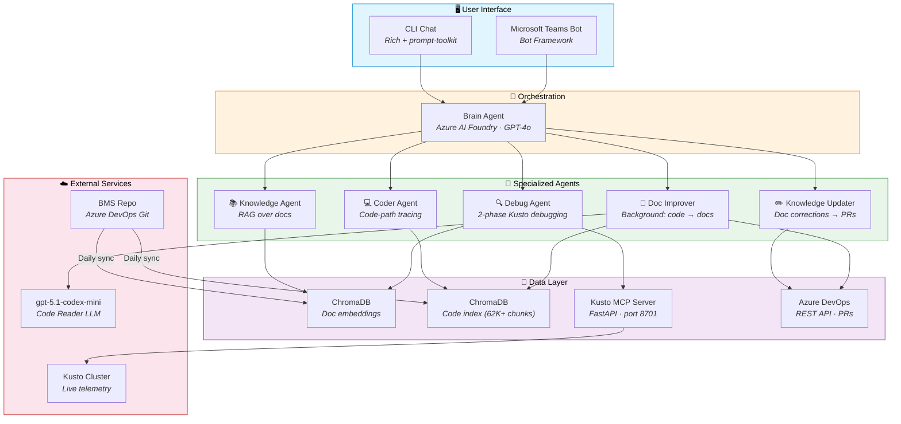

# 🧠 BCRD DeveloperAI - Azure Backup Management AI Assistant

Multi-agent CLI assistant powered by Azure AI Foundry (GPT-4o) that connects to your Azure DevOps documentation and Kusto for intelligent project assistance and debugging. Optionally extends to Microsoft Teams as a bot.

## Architecture



> **How it works:** The **Brain Agent** routes every user message to the best sub-agent based on intent.
> Agents query ChromaDB (docs & code), Kusto (live telemetry), or Azure DevOps (PRs) as needed.
> The **Doc Improver** runs in the background, reading source code with `gpt-5.1-codex-mini` and creating PRs for documentation gaps.

## Quick Start

### Option A: One-Command Setup (Recommended)

Run the setup script to do everything in one go — creates the venv, installs
dependencies, syncs docs, indexes everything, and optionally starts services:

```powershell
# PowerShell (Windows)
.\setup.ps1                        # Normal setup
.\setup.ps1 -Force                 # Force re-sync + re-index everything
.\setup.ps1 -SkipKusto             # Skip starting the Kusto server
.\setup.ps1 -SkipDocImprover       # Skip the Doc Improver cycle
```

```bash
# Bash (Linux / Mac / WSL)
chmod +x setup.sh
./setup.sh                         # Normal setup
./setup.sh --force                 # Force re-sync + re-index everything
./setup.sh --skip-kusto            # Skip starting the Kusto server
./setup.sh --skip-doc-improver     # Skip the Doc Improver cycle
```

The script will:
1. Create a `.venv` virtual environment (if missing)
2. Install all pip dependencies + editable package
3. Create `config.yaml` + `config.local.yaml` from templates (secrets go in `config.local.yaml`)
4. Sync docs from Azure DevOps
5. Index docs into ChromaDB
6. Index source code into ChromaDB
7. Run the Doc Improver (if enabled — handles bootstrap from zero docs)
8. Start the Kusto MCP server in background

### Option B: Step-by-Step Setup

#### 1. Install dependencies

```bash
pip install -r requirements.txt
# Or install as a package (includes all dependencies):
pip install -e .
```

#### 2. Configure

```bash
cp config.yaml.template config.yaml               # Generic settings (safe to commit)
cp config.local.yaml.template config.local.yaml     # Secrets (gitignored)
# Edit config.local.yaml with your:
#   - Azure DevOps PAT
#   - Azure AI Foundry endpoint & API key
#   - Kusto cluster URL & database
```

#### 3. Sync docs from Azure DevOps

```bash
python run_sync.py          # Incremental sync
python run_sync.py --force  # Force full sync
```

#### 4. Index docs into ChromaDB

```bash
python run_index.py          # Incremental
python run_index.py --force  # Force re-index
```

#### 5. Index source code (for Coder Agent)

```bash
python run_code_index.py          # Incremental
python run_code_index.py --force  # Force re-index
```

This indexes `.cs`, `.py`, `.json`, `.config` files from the BMS repo
into a separate ChromaDB collection so the Coder Agent can trace code paths.

#### 6. Start chatting

```bash
python run_chat.py
```

This is the **primary interface** for BCRD DeveloperAI. `run_chat.py` runs **automatic pre-flight checks** before launching the chat:

| Check | What it does |
|-------|-------------|
| Config | Validates `config.yaml` + `config.local.yaml` exist and have required fields |
| LLM | Verifies Azure AI Foundry endpoint & API key are set |
| ChromaDB | Checks if docs are indexed (warns if empty) |
| Code Index | Checks if source code is indexed for Coder Agent |
| Kusto MCP | Auto-starts the Kusto MCP server if not already running |

**Options:**

```bash
python run_chat.py --no-kusto          # Skip auto-starting Kusto MCP server
python run_chat.py --config my.yaml    # Use a custom config file
```

You can also run the Kusto MCP server **standalone** (e.g., for other tools):

```bash
python run_kusto_server.py              # default port 8701
python run_kusto_server.py --port 8701  # custom port
```

## CLI Commands

| Command    | Description                              |
|------------|------------------------------------------|
| `/help`    | Show help message                        |
| `/clear`   | Clear conversation history               |
| `/agents`  | List available agents                    |
| `/kusto`   | Check Kusto MCP server status            |
| `/code`    | Check code index status                  |
| `/pending` | Show staged doc corrections (if any)     |
| `/quit`    | Exit the chat                            |

## Daily Sync (Automation)

Run `run_daily.py` via cron or Windows Task Scheduler to keep both docs and source code up to date:

```bash
# Linux/Mac cron (daily at 2 AM)
0 2 * * * cd /path/to/bcrd_devai && python run_daily.py >> daily_sync.log 2>&1

# Or run manually
python run_daily.py
```

## Agent Overview

| Agent | Purpose | Data Source |
|-------|---------|-------------|
| **Knowledge** | Architecture & feature Q&A | ChromaDB (indexed docs) |
| **Debug** | Investigate job failures & errors | Kusto (live telemetry) + docs |
| **Coder** | Trace code paths & find root causes | ChromaDB (indexed source code) |
| **Knowledge Updater** | Correct docs & create PRs | ChromaDB + Azure DevOps REST API |
| **Doc Improver** | Background: auto-improve docs from code | ChromaDB (code) + gpt-5.1-codex-mini → PRs |

Routing is fully LLM-based — the Brain Agent reads conversation history and
selects the best sub-agent for each message.

### Knowledge Updater Workflow

When you spot incorrect or outdated documentation during a chat, the Knowledge
Updater Agent lets you fix it without leaving the conversation:

1. **State the correction** — e.g., _"That's wrong — retry logic uses 3 retries, not 5."_
2. The agent extracts the correction, finds the relevant doc, applies the edit,
   and **stages it locally**. Your local knowledge is updated immediately.
3. Provide more corrections if needed — they accumulate in the session.
4. Say **"submit"** or **"agree"** to batch all corrections into a **single
   Azure DevOps Pull Request** (one branch, one commit).
5. Say **"discard"** to drop all staged corrections without creating a PR.

Safety nets:
- Switching to another agent while corrections are pending shows a warning.
- `/quit` prompts you to submit or discard before exiting.
- `/clear` asks for confirmation before discarding pending corrections.

> **KQL sanitization:** Queries generated by the Debug Agent are automatically
> cleaned — leading `.project` commands, `database(...)` / `cluster(...)` scoping
> prefixes, and decorative comments are stripped before execution.

### Adding New Agents

1. Create a new agent class in `brain_ai/agents/` with a `handle(message, history)` method.
2. Register it in `config.yaml` under `agents.enabled`.
3. Update the `ROUTER_SYSTEM_PROMPT` in `brain_agent.py` to include the new agent's description.
4. Add initialization in `BrainAgent.__init__()`.

## Project Structure

```
BCRD-DeveloperAI/
├── brain_ai/                    # Python package
│   ├── config.py                # Configuration loader
│   ├── llm_client.py            # Azure AI Foundry LLM client
│   ├── code_reader_llm.py       # Code-optimized LLM (gpt-5.1-codex-mini)
│   ├── startup.py               # Pre-flight checks & dependency launcher
│   ├── sync/
│   │   ├── repo_sync.py         # Azure DevOps repo sync
│   │   └── devops_pr.py         # Azure DevOps PR helper (REST API)
│   ├── vectorstore/
│   │   ├── indexer.py           # ChromaDB document indexer
│   │   └── code_indexer.py      # ChromaDB source code indexer
│   ├── agents/
│   │   ├── brain_agent.py       # Router/orchestrator
│   │   ├── knowledge_agent.py   # RAG-based Q&A over docs
│   │   ├── debug_agent.py       # Kusto debug agent
│   │   ├── coder_agent.py       # Code path tracing agent
│   │   ├── knowledge_updater_agent.py  # Doc correction & PR agent
│   │   └── doc_improver_agent.py       # Background doc improvement agent
│   ├── kusto/
│   │   ├── client.py            # Kusto MCP client
│   │   └── server.py            # Kusto MCP server (FastAPI)
│   ├── bot/
│   │   ├── teams_bot.py         # Teams bot (ActivityHandler)
│   │   ├── adapter.py           # Bot Framework adapter
│   │   ├── app.py               # aiohttp web app + background services
│   │   └── teams_manifest/      # Teams app manifest template
│   └── cli/
│       └── chat.py              # CLI chat interface
├── deploy/
│   ├── main.bicep               # Azure Bicep IaC template
│   ├── parameters.json          # Deployment parameters template
│   └── deploy.ps1               # One-command deployment script
├── tests/                       # Unit tests
├── Dockerfile                   # Multi-stage Docker build
├── docker-compose.yml           # Docker Compose for all services
├── .env.template                # Environment variables template
├── config.yaml                  # Generic settings (committed)
├── config.local.yaml            # Secrets & overrides (gitignored)
├── config.yaml.template         # Template for config.yaml
├── config.local.yaml.template   # Template for secrets
├── pyproject.toml               # Package config & dependencies
├── requirements.txt             # Pip requirements
├── run_chat.py                  # CLI chat entry point
├── run_bot.py                   # Teams Bot entry point
├── run_sync.py                  # Sync docs entry point
├── run_index.py                 # Index docs entry point
├── run_code_index.py            # Index source code entry point
├── run_daily.py                 # Daily sync+index automation
├── run_kusto_server.py          # Kusto MCP server entry point
├── run_doc_improver.py          # Doc Improver entry point
├── setup.ps1                    # One-command setup (PowerShell)
└── setup.sh                     # One-command setup (Bash)
```

## Doc Improver Agent (Background Workflow)

The Doc Improver Agent is a background workflow that automatically improves documentation by reading the actual source code and comparing it against existing docs.

### How It Works

1. **Code Analysis** — Uses `gpt-5.1-codex-mini` (code-optimized model) to analyze source code from the ChromaDB code index and configured repo folders
2. **Gap Detection** — Compares code reality against documentation claims to find:
   - Missing information (undocumented APIs, code paths, validations)
   - Incorrect information (doc claims that contradict code)
   - Missing debugging patterns & KQL queries
   - Missing telemetry references
3. **Iterative Improvement** — Runs multiple passes (configurable, default 3) to refine docs, converging when no more changes are found
4. **Feature Discovery** — Scans the codebase for features that have no documentation at all and creates new doc files
5. **PR Creation** — If substantive changes are found (above `min_diff_lines` threshold), creates a single Azure DevOps PR with all improvements

### Standard Doc Template

Every feature doc follows this structure:
1. **Overview** — Feature purpose and scope
2. **API Endpoints** — Routes, HTTP methods, FM constants
3. **Request/Response Flow** — Code path from controller to catalog
4. **Business Logic & Validation** — Rules, state checks, errors
5. **State Machine / Lifecycle** — States and transitions
6. **Telemetry & Logging** — OpStats, activity stats, trace events
7. **Debugging Patterns & KQL Queries** — Concrete queries for common debug scenarios
8. **Error Handling** — Error codes, retry logic, failure modes
9. **Related Features** — Cross-references

### Running

```bash
# Run one improvement cycle
python run_doc_improver.py

# Force run (ignore interval timer)
python run_doc_improver.py --force

# Override max iterations
python run_doc_improver.py --iterations 5

# Run as a repeating daemon
python run_doc_improver.py --daemon
```

### Configuration

```yaml
# config.yaml — model & structural settings (committed)
code_reader_llm:
  model: "gpt-5.1-codex-mini"
  max_tokens: 16384

# Doc Improver settings
doc_improver:
  enabled: true
  run_interval_hours: 72        # How often to run
  max_iterations: 3             # Improvement passes per cycle
  code_folders:                 # Repo folders to read for code analysis
    - "src/Microsoft.Azure.Management.BackupManagement"
  protected_docs:               # Docs that are NEVER modified
    - "BackupMgmt_Architecture_Memory.md"
  branch_prefix: "bcrd-devai/doc-improvement"
  min_diff_lines: 10            # Minimum changed lines to create a PR
```

### Safety Rules

- `BackupMgmt_Architecture_Memory.md` is **protected** — never modified
- Retains the existing `DPP/` and `RSV/` folder structure
- References `Telemetry_And_Logging_Reference.md` for all KQL patterns
- Only creates a PR when meaningful changes are discovered
- Runs automatically as a background service when the Teams Bot is deployed

---

## Extensions

### Microsoft Teams Bot

BCRD DeveloperAI can optionally be deployed as a Microsoft Teams bot, providing the same
multi-agent experience directly in Teams channels and chats.

#### Features

| Feature | Description |
|---------|-------------|
| **@mention responses** | Tag @BCRD-DeveloperAI in any channel to ask a question |
| **Auto-reply (10 min)** | If nobody answers a channel question within 10 minutes, BCRD DeveloperAI responds automatically |
| **1:1 chat** | Direct message the bot for private conversations |
| **Session isolation** | Each conversation gets its own BrainAgent session |
| **Commands** | `help`, `clear`, `agents` — same as the CLI |

#### Local Development

1. Install Teams bot dependencies:
   ```bash
   pip install "bcrd-devai[teams]"
   # or: pip install botbuilder-core aiohttp
   ```

2. Start the bot locally:
   ```bash
   python run_bot.py
   ```

3. Use [Bot Framework Emulator](https://github.com/microsoft/BotFramework-Emulator) to test at `http://localhost:3978/api/messages`

4. For Teams testing, use [ngrok](https://ngrok.com/) or [dev tunnels](https://learn.microsoft.com/en-us/azure/developer/dev-tunnels/):
   ```bash
   ngrok http 3978
   # Then update your Bot registration's messaging endpoint with the ngrok URL
   ```

#### Bot Registration

1. Go to [Azure Portal](https://portal.azure.com) → Create **Azure Bot** resource
2. Note the **App ID** and generate an **App Password** (client secret)
3. Set messaging endpoint to `https://<your-domain>/api/messages`
4. Enable the **Microsoft Teams** channel
5. Update `config.local.yaml`:
   ```yaml
   teams_bot:
     app_id: "<YOUR_APP_ID>"
     app_password: "<YOUR_APP_PASSWORD>"
   ```

### Deployment (Azure Container Apps)

For production use, BCRD DeveloperAI ships with Docker + Azure Bicep infrastructure for one-command cloud deployment.

#### What Gets Deployed

| Resource | Purpose |
|----------|---------|
| **Azure Container Registry** | Stores the Docker image |
| **Azure Container Apps** | Runs the bot + all background services |
| **Azure Bot Service** | Connects to Microsoft Teams |
| **Log Analytics Workspace** | Centralized logging |

**All background services run inside the single container:**
- 🤖 Teams Bot (port 3978)
- 🔍 Kusto MCP server (port 8701)
- 📅 Daily sync scheduler (configurable interval)
- 💡 Unanswered-message auto-reply monitor
- 📝 Doc Improver Agent (configurable cycle interval)

#### Option A: One-Command Deploy (Recommended)

```powershell
.\deploy\deploy.ps1 -ResourceGroup bcrd-devai-rg `
    -BotAppId "<APP_ID>" `
    -BotAppPassword "<APP_PASSWORD>" `
    -LlmApiKey "<LLM_KEY>" `
    -AzureDevOpsPat "<PAT>"
```

Or run interactively (prompts for values):
```powershell
.\deploy\deploy.ps1
```

#### Option B: Docker Compose (Self-Hosted)

```bash
# Copy and fill in environment variables
cp .env.template .env
# Edit .env with your secrets

# Build and start
docker compose up -d

# Check logs
docker compose logs -f bcrd-devai-bot

# Trigger manual sync
docker compose exec bcrd-devai-bot python run_daily.py
```

#### Option C: Manual Azure Deployment

```bash
# 1. Create resource group
az group create --name bcrd-devai-rg --location eastus2

# 2. Deploy infrastructure
az deployment group create \
  --resource-group bcrd-devai-rg \
  --parameters deploy/parameters.json

# 3. Build & push image
az acr login --name bcrddevaiacr
docker build -t bcrddevaiacr.azurecr.io/bcrd-devai:latest .
docker push bcrddevaiacr.azurecr.io/bcrd-devai:latest

# 4. Update container app
az containerapp update --name bcrd-devai-bot \
  --resource-group bcrd-devai-rg \
  --image bcrddevaiacr.azurecr.io/bcrd-devai:latest
```

#### Updating After Code Changes

```powershell
# Rebuild and push image only (skip infra redeployment)
.\deploy\deploy.ps1 -SkipDeploy -ResourceGroup bcrd-devai-rg
```

## Future Roadmap

- [x] Coder Agent — code path tracing over indexed BMS source
- [x] Knowledge Updater Agent — session-based doc corrections with batch Azure DevOps PRs
- [x] KQL query sanitization — auto-strips `.project` commands & scoping prefixes
- [x] MS Teams Bot integration (Azure Bot Service)
- [x] Docker containerization for deployment
- [x] Azure Container Apps deployment (Bicep IaC)
- [x] Doc Improver Agent — background auto-improvement of docs from code analysis
- [ ] Azure Key Vault for secrets management
- [ ] **More agents planned** — CI/CD pipeline agent, PR review agent, incident triage agent, and others will be added as the platform matures. The plug-in architecture makes it easy to extend (see [Adding New Agents](#adding-new-agents)).
